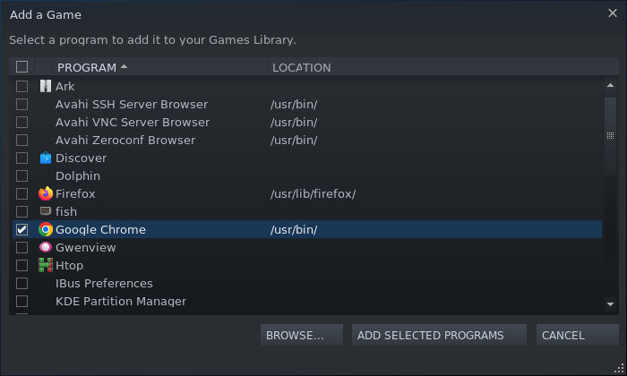
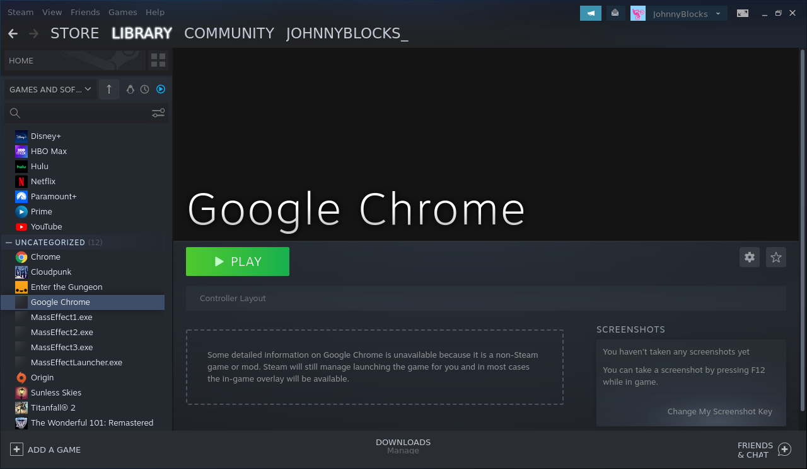
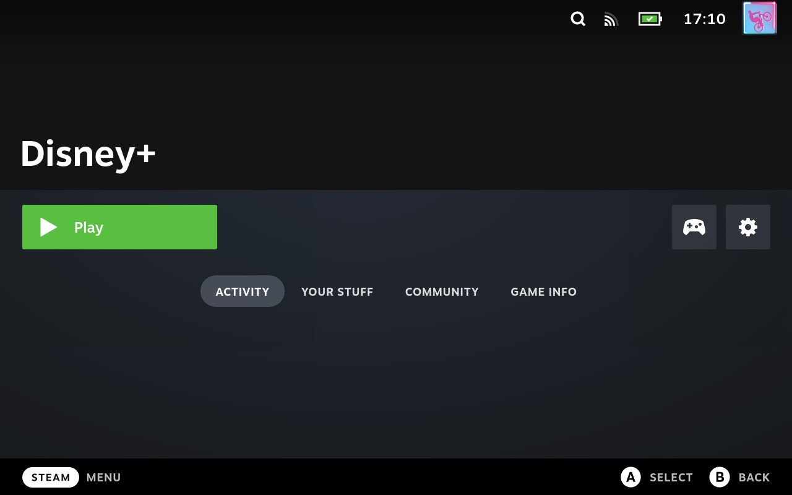
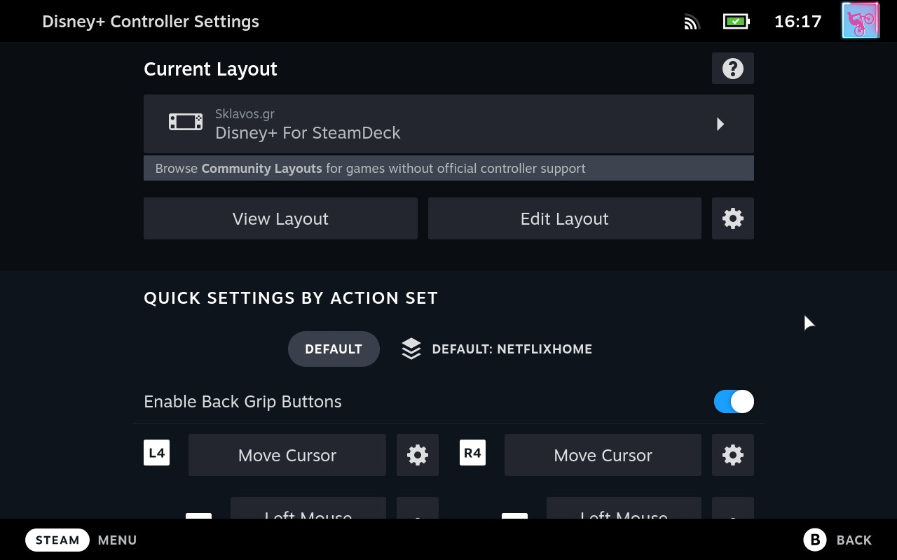

This is the process to add popular streaming services to the SteamDeck as non-steam games.  The process works for any stream service that is accessible via chrome on windows PC.  It will create a dedicated shortcut that can be run as a steam game, allowing you to stream content full screen.

<!--more-->

This guide will use Chrome as the Browser in the examples, but will also show how to use Edge.  
Follow [THIS GUIDE](microsoft_edge.md) to install Microsoft Edge on the Steam Deck.

I currently use Disney+, HBOMax, Hulu, Netflix, Paramount+, Prime Video, and YouTube.  


## Step-by-Step

### Prerequisite

Decide which streaming service you want to add.  Find the URL for the streaming section.  
This is the URL you are on once successfully logged in and ready to make a video selection.  
For this demonstration I will be adding Disney+.  
The URL is [https://www.disneyplus.com](https://www.disneyplus.com).

### A. Add Chrome or Edge as Non-Steam Game  

1. Restart into '**Desktop**' Mode of the Deck.

2. Start '**Steam**' so it runs in Desktop mode.

3. In Steam, click the '**ADD A GAME**' button in the lower left corner.  
     

4. Select '**Google Chrome**'  from the list and click '**ADD SELECTED PROGRAMS**'  
Note:  You may alternately select '**Microsoft Edge**' at this step.

5. '**Google Chrome**' or '**Microsoft Edge**' should now show in your list of games.  
     

### B. Change Name and Parameters

1. Right click on the shortcut name '**Google Chrome**' (or '**Microsoft Edge**' depending on your choice) in your game list  
    Select '**Properties...**' and the properties for the shortcut will open.  
   

2. Click into the area that says '**Google Chrome**' (or '**Microsoft Edge**' depending on your choice) and change the name.  
    I am adding Disney Plus, so I changed the name to 'Disney+'.

3. Ignore '**TARGET**' and '**START IN**' fields.

4. Replace the '**LAUNCH OPTIONS**' with this entire code segment, replacing the disneyplus URL with the streaming service of your choice.  

    **For Google Chrome**

    ```text
    run --branch=stable --arch=x86_64 --command=/app/bin/chrome --file-forwarding com.google.Chrome @@u @@ --window-size=1024,640 --force-device-scale-factor=1.25 --device-scale-factor=1.25 --kiosk https://www.disneyplus.com --edge-kiosk-type=fullscreen --no-first-run
    ```

    **For Microsoft Edge**

    ```text
    run --branch=stable --arch=x86_64 --command=/app/bin/edge --file-forwarding com.microsoft.Edge @@u @@ --window-size=1024,640 --force-device-scale-factor=1.25 --device-scale-factor=1.25 --kiosk https://www.disneyplus.com --edge-kiosk-type=fullscreen --no-first-run
    ```

5. Click in the Dark Square next to '**Disney+**' and change it to a Disney+ image file of your choice then close the '**SHORTCUT**' window.  
   

6. Disney+ is now in your game library as a non-steam game.  
    Restart into '**Game Mode**'

### C. Add Controller Layout, Grid Icons, Banner, and Heroes

1. Find '**Disney+**' in your game library and click on it to select it.  
     

2. Click on the controller icon 🎮 to the right to add a controller layout.  
    The '**Disney+ Controller Settings**' window will open.  
     

3. Select the Controller Layout that is ideal for you.  
    The default '**Web Browser**' makes the controller work intuitively with the streaming services.  
    You can customize it to your liking or search for a community configuration of your choice.  
    There is a '**Disney+ for SteamDeck**' controller configuration that I am using.

4. Add Icon, Banner, and Heroes for Disney+ to make it look like an offical app.  
<img src="../media/add_nonsteam_6.jpg)

    This can be done via [SteamGridDB](https://www.steamgriddb.com/) manually, via the [SGDBoop](https://www.steamgriddb.com/boop) app, or via [BoilR](https://github.com/PhilipK/BoilR)
    This site will have guides linked here once I have time to write them up.

5. Launch the newly added app, log in with your account, and start streaming.  
    Chrome (or Edge) will cache your credentials and your login with persist.

    Next time you launch the app, it will already be logged in, ready to start streaming.
