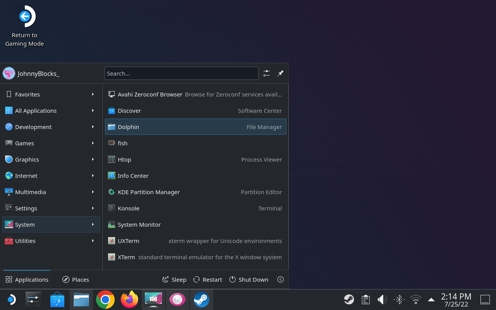

This is the process to add the **Microsoft Edge** browser to your Steam Deck.  

<!--more-->

## A. Add Microsoft Edge Browser via Discovery Store

1. Restart into '**Desktop**' Mode of the Deck.  

2. Click on the '**Steam Icon**' in the lower left corner.  
    Click on the '**System**' to show the applications.  
    Click on '**Discover**' to start the Software Center.
      

3. In the '**Discover Software Center**', search for '**Edge**'
    When Microsoft Edge shows as a result, click on the '**Install**' button.
   

4. Once the installation is complete the browser is ready to use.
