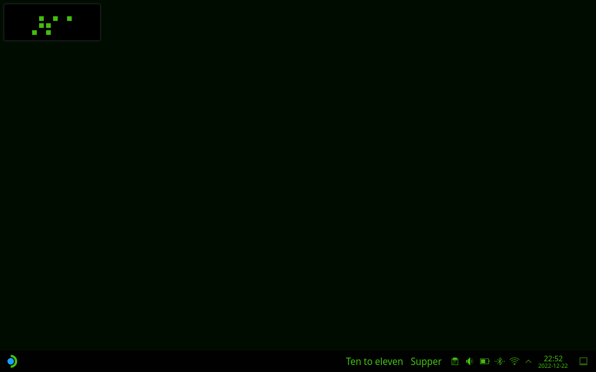
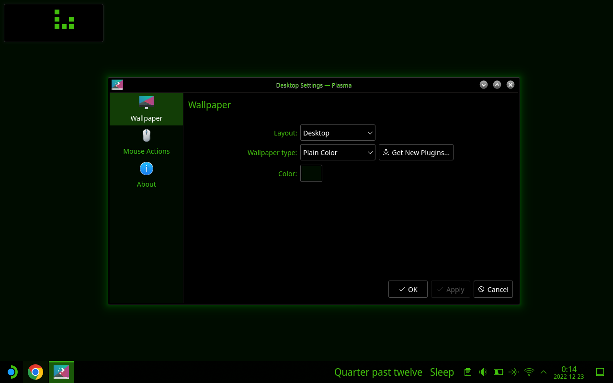
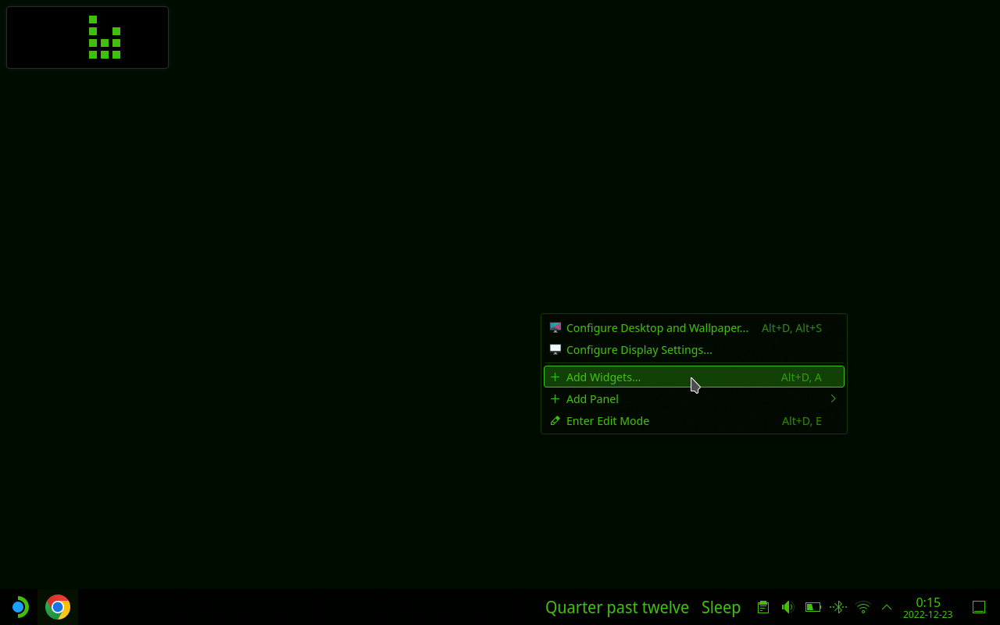
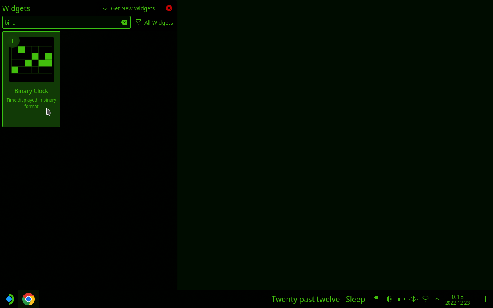
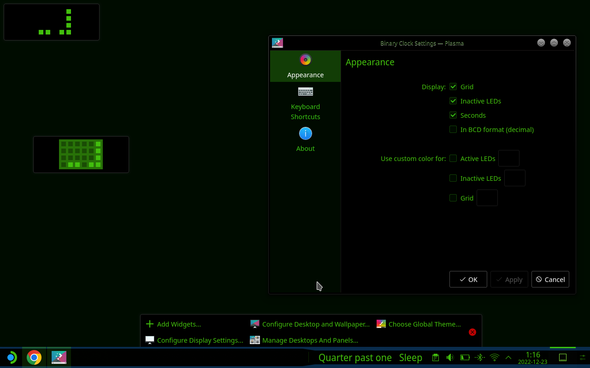
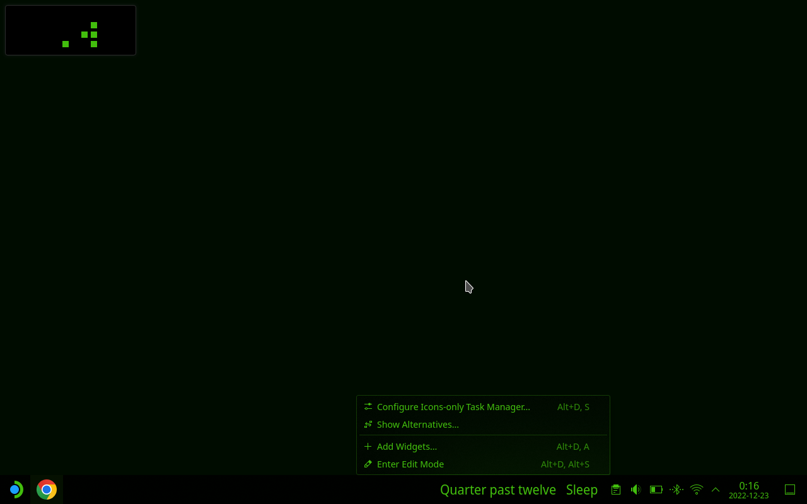
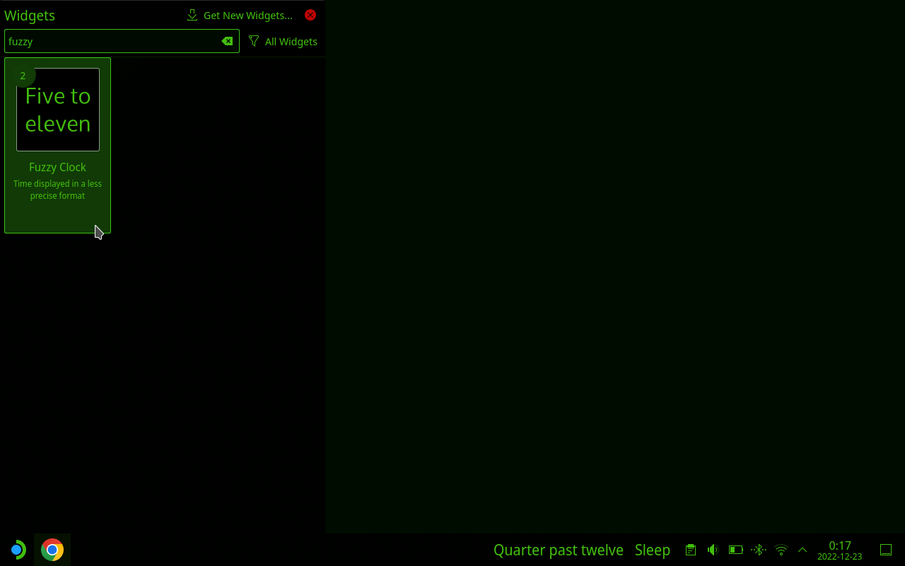

This is part of a series on themeing your Steam Deck desktop experience.  This part will cover the Desktop Folder and how to add widgets.

<!--more-->

## Matrix Inspired

I'm using a [Matrix boot animation](https://steamdeckrepo.com/post/PBVwP/the_matrix_intro_by_knightmd) from [KnightMD](https://steamdeckrepo.com/user/71) so I decided to theme my desktop experience to match.  This is my current desktop setup.

  

### Hide Desktop Icons

I like a clean desktop.  I don't care for icons on my desktop.  It looks cluttery.   I access files via the file manager and not from clicking on the desktop.  It's just another folder to me.

1. Right Click on the Desktop
2. Select 'Configure Desktop and Wallpaper...'
3. Change Layout from 'Folder' to 'Desktop'
4. Click 'OK' or 'Apply'
Note: This is where you can change your wallpaper as well.

  

## Desktop Widgets

There are many desktop widgets for the Steam Deck.  It's Arch Linux running KDU and it brought the widgets with.  Visualiztions for memory, processor, storage utilization, KDE Connect (connect your phone to your Steam Deck), and so many others.

## Add Binary Clock

I like the [Binary Clock](https://en.wikipedia.org/wiki/Binary_clock).  While I wont actually use it to tell time, I like the aethetic.

1. Right click on the desktop and lect '+ add widgets...'

2. Filter the list by typing 'Binary' into the search box.
3. Click on the Binary Clock Widget and it will be added to your desktop.
  
4. Right click on the desktop and select 'Enter Edit Mode'
5. Resize the Binary Clock and move it to the desired location.
6. Right Click on the widget and select 'Configure Binary Clock'

7. Modify the Configuration to your preference and save the changes
8. Click on the red circle x below to close 'Edit Mode'
9. Enjoy your new Binary Clock Widget.

## Add Fuzzy Clock

I also like [Fuzzy Clocks](https://en.wikipedia.org/wiki/Fuzzy_logic) so I added it to my Task Bar.  I even added it twice to get two values at different accuracy levels.

1. Right click on the decktop and lect '+ add widgets...'

2. Filter the list by typing 'Fuzzy' into the search box.
3. Click on the Fuzzy Clock Widget and it will be added to your Task Bar.
4. If you want two then click it again.
  
5. Right Click on the first Fuzzy Clock widget and select'Configure Fuzzy Clock'
6. Select your desired level of fuzzyness and save.
Mine uses the left most 'Accurate' setting.
7. Right Click on the second Fuzzy Clock widget and select 'Configure Fuzzy Clock'
8. Select your desired level of fuzzyness.
Mine on the right uses the center setting.
9. Modify the Configuration to your preference and save the changes

10. Enjoy your Fuzzy Clock

  
